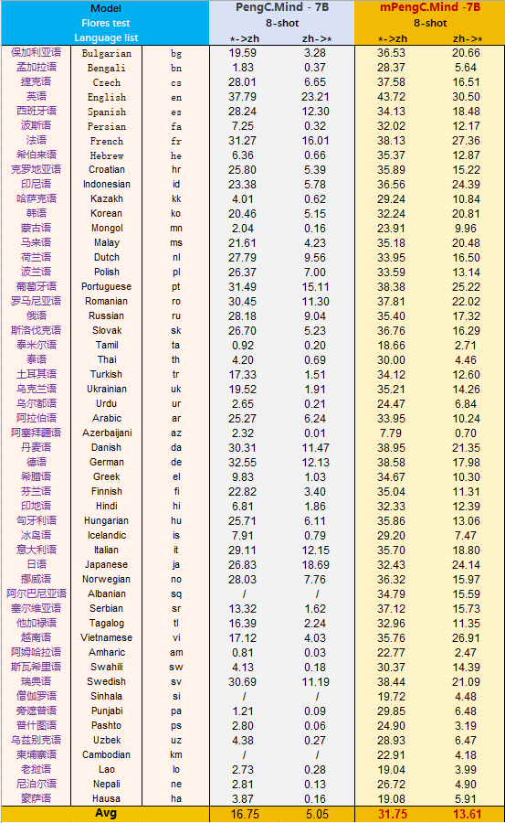

# mPC-mind

multilingual PengCheng-Mind 鹏城·多语言脑海大模型是基于Transformer架构的自回归式多语言模型。模型全流程基于全自主安全可控国产软硬件平台进行开发和训练，采用MindSpore框架实现在大规模集群上长期稳定的多维分布式并行训练。鹏城·多语言脑海模型以鹏城·脑海7B模型为基座，已完成训练200B Tokens多语言数据，具备中文核心能力以及53个语种的多语言能力。

# 要点

* 支持53个语种的多语言模型「鹏城·多语言脑海」
* 代码、模型全开源
* MindSpore超大规模自动并行技术
* 模型基于国产全栈式软硬件协同生态（MindSpore+CANN+昇腾910+ModelArts）

## 模型结构

| multilingual PengCheng-Mind 7B | 结构参数 |
| :---- | :---- |
| seq_length | 4096 |
| vocab_size | 125952 |
| embedding_size | 4096 |
| num_layers | 32 |
|num_heads | 32 |

## 环境要求
支持 python >= 3.7.5, mindspore >= 2.0.0-beta 版本.

推荐使用mindspore的官方 docker 镜像。

## 模型演化和开源

npu版本模型下载地址：

[Huggingface](https://huggingface.co/PCLNLP/mPengC.mind_npu)

[魔搭社区](https://modelscope.cn/models/PCLNLP/mPengC.Mind_npu)

gpu版本模型下载地址：

[Huggingface](https://huggingface.co/PCLNLP/mPengC.mind_gpu)

[魔搭社区](https://modelscope.cn/models/PCLNLP/mPengC.Mind_gpu)

## 推理

### 1、7B鹏城·多语言脑海模型推理

启动命令（--offline 1代表使用NPU裸机，修改脚本中local_ckpt_path为脑海7B预训练模型文件路径; --offline 0代表使用modelarts环境,修改脚本中restore_checkpoint_bucket_dir为脑海7B预训练模型文件路径;）:
```
python predict_mPCmind7B.py \
--run_type predict \
--mode 7B \
--vocab_size 125952 \
--seq_length 4096 \
--distribute true \
--use_pynative_op 1 \
--op_level_model_parallel_num 1 \
--device_num 1 \
--stage_num 1 \
--top_p 1.0 \
--top_k_num 1 \
--max_generate_length 150 \
--pre_trained true \
--lang_idx 0 \
--use_rope True \
--use_past True \
--offline 0
```

### 2、翻译结果评测

我们使用flores-200数据集在53个语种上进行翻译测试，测试结果采用sacrebleu指标。

评测数据：```/data/mPC_flores-devtest.json```

#### 评测结果：



## 微调

### 1、准备训练数据

参考[数据](#数据)部分

### 2、预训练模型加载，增量训练

启动命令（修改脚本中 restore_checkpoint_bucket_dir、restore_ckpt_name_prefix为多语言脑海7B预训练模型文件路径）：

```
python train_mPCmind7B.py \
--data_url YOUR_DATA_PATH \
--mode 7B \
--vocab_size 125952 \
--embedding_size 4096 \
--num_layers 32 \
--num_heads 32 \
--seq_length 4096 \
--device_num YOUR_DEVICE_NUM \
--stage_num 4 \
--op_level_model_parallel 2 \
--epoch_size 1 \
--micro_size 16 \
--optimizer_shard 1 \
--micro_batch_interleaved 1 \
--full_batch 0 \
--per_batch_size 1 \
--sink_size 2\
--warmup_step 1000 \
--param_init_type fp16 \
--start_lr 6e-05 \
--end_lr 1e-06 \
--save_checkpoint True \
--save_checkpoint_steps 2000 \
--save_strategy_bucket_dir YOUR_SFT_strategySaving_OBS_PATH \
--offline 0 \
--save_checkpoint_path YOUR_SFT_LOCAL_PATH \
--save_checkpoint_bucket_dir YOUR_SFT_OBS_PATH \
--save_summary_bucket_dir YOUR_SFT_summarySaving_OBS_PATH \
--recompute False \
--sequence_parallel True \
--use_rope True \
--select_recompute False \
--ckpt_name_prefix YOUR_SFT_PREFIX \
--pre_trained True
```

### 3、模型合并

增量训练后的模型是分片的，如果要进行推理，则需要先对模型进行合并。

合并脚本参考：
```
python tools/merge_ckpt.py --local_ckpt_save_name YOUR_LOCAL_SAVE_PATH --obs_ckpt_save_name YOUR_OBS_SAVE_PATH --restore_checkpoint_bucket_dir YOUR_MODEL_PATH --restore_ckpt_name_prefix YOUR_MODEL_PREFIX --rank YOUR_DEVICE_NUM --strategy YOUR_MERGED_STRATEGY_FILE
```
策略文件合并可使用mindspore.merge_pipeline_strategys进行。

## 数据

### 生成训练数据

参考脚本：```/tools/pre_process_data.py```


## NPU模型转GPU

模型转换见：https://huggingface.co/PCLNLP/mPengC.mind_gpu

## 声明

[鹏城·脑海模型开源协议](/docs/鹏城·脑海模型开源协议.pdf)
